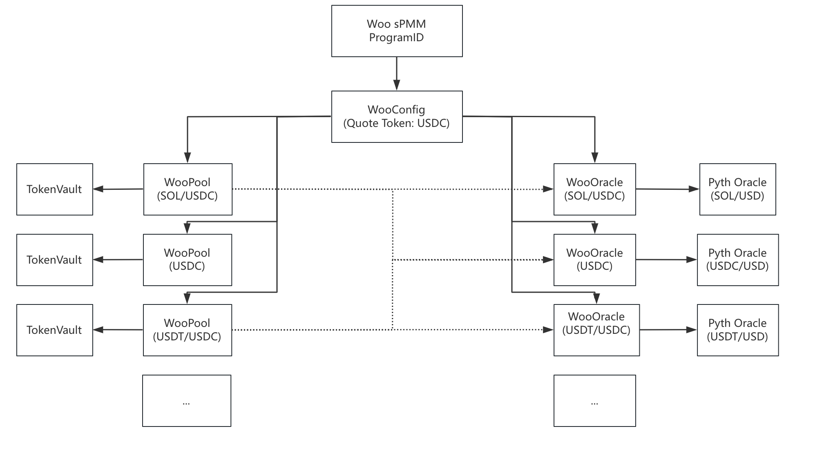

# Architecture Overview

## Account Structure

<figure><figcaption></figcaption></figure>

WooFi's sPMM is Synthetic Proactive Market Making (sPMM) contract on the Solana blockchain.
This repository contains the Rust smart contract as well as the Typescript SDK (`@woonetwork/WOOFi_Solana`) to interact with a deployed program.

## WooConfig

A WooConfig is a config struct to recrod:
   - authority: Owner of the program
   - paused: Whether the program is paused
   - Woopool's admin authority
   - Wooracle's admin_authority
   - Collect fee authority
   - Guardian set authority
   - Puase program authority

## WooPool

A WooPool is a concentrated liquidity pool for a token.

Each WooPool account hosts the necessary information to deal with the accounting of the pool. It also hosts the PDAs to the vaults. Only the Woo sPMM program has authority to withdraw from the vault. 

A WooPool account is hashed by the WooConfig, token mint address and quote token mint address.

## WooOracle

A WooOracle is a on-chain price feed in order to simulate the order book from centralized exchanges without sacrificing capital efficiency.

WooFi in Solana use [Pyth oracle](https://www.pyth.network/developers/price-feed-ids#solana-stable) to check whether Woo oracle's price is valid.

Detail explaination can check on [WooFi Developer Portal](https://learn.woo.org/v/woofi-dev-docs/resources/on-chain-price-feeds)

## Fee rate

Fee rate setting stored in WooPool's fee_rate param, can be updated by set_pool_fee_rate function by admin.